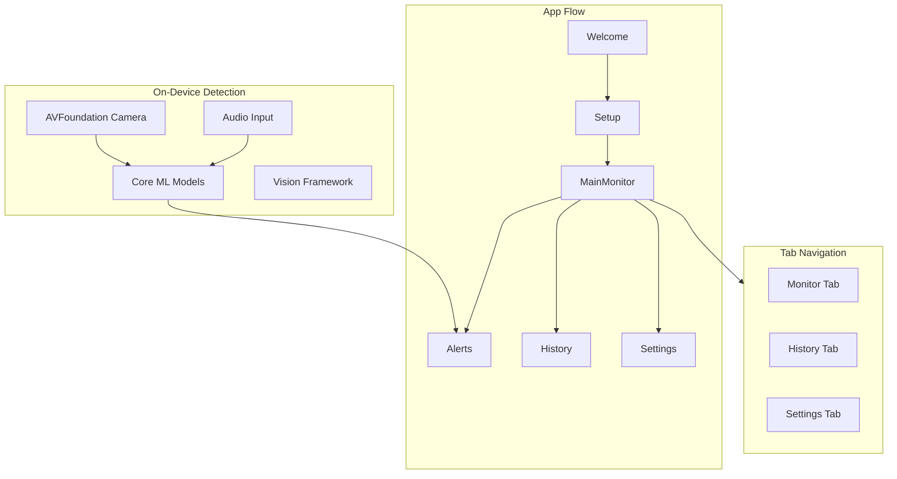

# CribAlert iOS App - Complete Build Plan

## Project Overview

CribAlert is a **non-medical baby sleep safety monitoring app** that uses camera and microphone to observe visible sleep conditions and alert parents when attention may be needed. The app must be calm, privacy-first, and work without account creation or payment.

---

## Architecture Overview



---

## Phase 1: Project Foundation (Milestone 0)

### Step 1.1: Initialize iOS Project

**Task:** Create Xcode project with Swift/SwiftUI

**Actions:**

1. Create new Xcode project: "CribAlert" iOS App (SwiftUI lifecycle)
2. Set deployment target to iOS 16.0+
3. Configure bundle identifier: `com.cribalert.app`
4. Enable required capabilities: Camera, Microphone, Background Processing, Notifications

**Testable Outcome:**

- App builds and runs on iOS Simulator
- Empty SwiftUI view displays "Hello CribAlert"

### Step 1.2: Define Design System

**Task:** Create design tokens matching UI designs

**Actions:**

1. Create `DesignSystem.swift` with color palette:

   - Primary Green: `#00D26A` (CTA buttons)
   - Accent Blue: `#3B82F6` (links, toggles)
   - Alert Amber: `#FEF3C7` (alert backgrounds)
   - Text Primary: `#1F2937`
   - Background: `#F9FAFB` (light gray-white)

2. Define typography scale (SF Pro or system fonts)
3. Create reusable button styles (primary green, secondary white, text link)
4. Define spacing constants (8pt grid system)

**Testable Outcome:**

- Preview shows buttons/colors matching UI designs
- All tokens documented in code comments

### Step 1.3: Set Up Navigation Structure

**Task:** Create app navigation skeleton

**Actions:**

1. Create `AppState` observable object for global state
2. Implement root navigation: Onboarding vs Main (TabView)
3. Create TabView with 3 tabs: Monitor, History, Settings
4. Create placeholder views for all screens

**Testable Outcome:**

- App shows Welcome screen on first launch
- After setup, app shows tab bar with 3 tabs
- Navigation between tabs works correctly

---

## Phase 2: Welcome and Safety Disclosure (Milestone 1)

### Step 2.1: Welcome Screen UI

**Task:** Implement welcome screen exactly as designed

**Actions:**

1. Create `WelcomeView.swift` with:

   - CribAlert logo and header
   - Illustration of sleeping baby in crib
   - "Welcome to CribAlert" title
   - Subtitle: "Let's help everyone get a better night's rest with smart monitoring."
   - Safety First card with shield icon
   - Checkbox: "I understand this is a safety aid, not a medical device."
   - "Start Setup" button (disabled until checkbox checked)
   - Page indicator dots (1 of 4)

**Testable Outcome:**

- Screen matches `welcome_&_safety_disclaimer/screen.png` exactly
- "Start Setup" button disabled until checkbox is checked
- Wording includes "not a medical device" and "does not monitor vital signs or prevent SIDS"

### Step 2.2: Persist Disclaimer Acceptance

**Task:** Store user acknowledgment

**Actions:**

1. Use `@AppStorage` to persist `hasAcceptedDisclaimer: Bool`
2. On acceptance, navigate to Setup flow
3. Skip Welcome screen on subsequent launches

**Testable Outcome:**

- Relaunch app after accepting: Welcome screen skipped
- Fresh install shows Welcome screen

---

## Phase 3: Setup and Calibration (Milestone 2)

### Step 3.1: Baby Name Screen (Step 1 of 4)

**Task:** Implement baby name input screen

**Actions:**

1. Create `BabyNameSetupView.swift` with:

   - Back button, "Step 1 of 4" header
   - Progress bar (25% filled)
   - Baby face icon in circle
   - "What do you call your baby?" title
   - Text field with pencil icon: "Baby's name"
   - Helper text: "We'll use this name for personalized safety alerts."
   - "Continue" button

**Testable Outcome:**

- Screen matches `onboarding__baby's_name/screen.png`
- Continue button disabled if name is empty
- Name is saved to `BabyProfile` model

### Step 3.2: Camera Placement Screen (Step 2 of 4)

**Task:** Implement device mounting instructions

**Actions:**

1. Create `CameraPlacementView.swift` with:

   - "Step 2 of 4" header, Skip button, Back button
   - Progress bar (50% filled)
   - Illustration of phone mounted above crib
   - "Mount your device" title
   - Instructions: "For best results, place your camera 3-4 feet directly above the crib with a clear, top-down view."
   - Info link: "Don't have a mount?"
   - "Next" green button

**Testable Outcome:**

- Screen matches `setup__camera_placement_2/screen.png`
- Skip button navigates to next step
- Next button proceeds to sleep area definition

### Step 3.3: Define Sleep Area Screen (Step 3 of 4)

**Task:** Implement ROI selection with live camera

**Actions:**

1. Create `DefineSleepAreaView.swift` with:

   - "Step 3 of 4" header, Skip button
   - Progress bar (75% filled)
   - Live camera preview with dark overlay
   - "LIVE VIEW" indicator (red dot)
   - Draggable rectangle with 4 corner handles
   - Grid overlay inside selected area
   - "Define the sleep area" title
   - Instructions: "Drag the corners to fit the edges of the mattress. This helps the monitor ignore movement outside the crib."
   - "Confirm Area" green button with checkmark

**Testable Outcome:**

- Screen matches `setup__camera_placement_1/screen.png` (Step 3)
- Camera preview displays live feed
- Corner handles are draggable
- ROI coordinates are saved to settings

### Step 3.4: Final Setup Check Screen (Step 4 of 4)

**Task:** Implement calibration with progress indicator

**Actions:**

1. Create `FinalSetupCheckView.swift` with:

   - "Step 4 of 4" header, Back button
   - Progress bar (100% filled)
   - Live camera preview showing crib detection box
   - "AI ACTIVE" badge (green dot)
   - Detection frame overlay on camera
   - "Final setup check" title
   - Progress indicator: "Setting up... 75%" with animated bar
   - Status text: "Checking camera placement and lighting to help reduce false alerts."
   - Privacy card with lock icon: "Privacy first. No video is ever stored or uploaded. Analysis happens locally on your device."
   - "Start Monitoring" green button (enabled when calibration complete)

**Testable Outcome:**

- Screen matches `setup__camera_placement_3/screen.png`
- Progress bar animates from 0% to 100%
- Button enables only after calibration completes
- Privacy message is prominently displayed

---

## Phase 4: Live Monitoring Main Screen (Milestone 3)

### Step 4.1: Main Monitoring View - Active State

**Task:** Implement main monitoring screen with live feed

**Actions:**

1. Create `MonitorView.swift` with:

   - Header: "[Baby Name]'s Room", "LIVE" indicator (red dot), settings icon
   - Status card (green): checkmark + "[Baby Name]'s sleep looks normal"
   - Live camera preview with rounded corners
   - "LIVE PREVIEW" indicator (green dot)
   - Overlay controls: microphone, camera, fullscreen buttons
   - Movement indicator card: icon + "Movement" + "Still" + "Looks normal"
   - Position indicator card: bed icon + "Position" + "On Back" + "Recommended sleep position"
   - Safety Alerts toggle row with switch
   - Recent Activity section with "View All" link
   - Activity items: time + event description
   - Bottom tab bar: Monitor (active), History, Settings

**Testable Outcome:**

- Screen matches `refined_live_safety_monitor_4/screen.png`
- Live camera feed displays correctly
- Status card shows baby's name dynamically
- Toggle switch works correctly
- Recent activity shows placeholder data

### Step 4.2: Implement Camera Session Manager

**Task:** Create AVFoundation camera pipeline

**Actions:**

1. Create `CameraManager.swift` class with:

   - AVCaptureSession setup for rear camera
   - Preview layer configuration
   - Frame rate control (low FPS for efficiency)
   - Start/stop monitoring methods
   - Handle camera permission requests

**Testable Outcome:**

- Camera preview shows live feed
- No crashes on permission denial
- Low CPU usage during monitoring

---

## Phase 5: Monitoring Paused State (Milestone 4)

### Step 5.1: Monitoring Paused UI State

**Task:** Implement offline/disconnected state

**Actions:**

1. Modify `MonitorView.swift` to show paused state:

   - Header changes to "OFFLINE" indicator (gray dot)
   - Status card (gray): info icon + "Monitoring paused" + "The camera is not connected right now."
   - Camera preview: blurred/grayed with "Live view unavailable" and camera-off icon
   - "Reconnect camera" green button
   - "Run camera setup" text link
   - Reassurance text: "You'll receive alerts again once monitoring resumes."
   - Movement/Position cards show "--" with "Waiting for connection"

**Testable Outcome:**

- Screen matches `refined_live_safety_monitor_1/screen.png`
- State automatically triggers when camera disconnects
- "Reconnect camera" button attempts reconnection
- No alerts fire while in paused state

### Step 5.2: Implement State Detection Logic

**Task:** Detect camera disconnect, app backgrounding, battery states

**Actions:**

1. Monitor `AVCaptureSession` for interruptions
2. Observe `UIApplication` lifecycle notifications
3. Check battery state using `UIDevice.current.batteryState`
4. Transition to paused state when any failure detected

**Testable Outcome:**

- Disconnecting camera shows paused state within 2 seconds
- Backgrounding app triggers paused state
- State auto-recovers when condition resolves

---

## Phase 6: Safety Alert System (Milestone 5)

### Step 6.1: Alert View - High Severity (Position/Face Covered)

**Task:** Implement full-screen alert for high severity events

**Actions:**

1. Create `SafetyAlertView.swift` for high severity with:

   - Amber/cream background color
   - "SAFETY ALERT" label (dark red)
   - Alert title: "Baby's face may be covered" or "Baby rolled onto stomach"
   - Description text: "Please check the sleep area to make sure your baby's face is clear." or "Please check your baby"
   - Live camera preview with "LIVE" indicator
   - Primary button (dark): "View live camera"
   - Secondary button (white): "I am checking"
   - Text link: "Mark as okay"

**Testable Outcome:**

- Alert matches `refined_live_safety_monitor_2/screen.png` and `refined_live_safety_monitor_5/screen.png`
- Alert appears as full-screen modal
- All three action buttons function correctly
- Alert can be dismissed without forcing interaction

### Step 6.2: Alert View - Medium Severity (Stillness/Crying)

**Task:** Implement alerts for unusual stillness and crying

**Actions:**

1. Create medium severity variant with:

   - Light background (white/cream)
   - "MONITORING MOVEMENT" tag (amber)
   - "Unusual Stillness Detected" title
   - Description: "We haven't seen normal movement for a while. This can happen during deep sleep. Please take a moment to check your baby."
   - Live camera preview
   - Same action buttons as high severity

2. Create crying alert variant:

   - Light blue/white background
   - Sound wave animation icon
   - "Listening for sounds" tag
   - "Crying Detected" title
   - Description: "Your baby sounds upset and may need you."
   - "Open live view" primary button
   - "Mute for 5 minutes" secondary button
   - "Dismiss" text link

**Testable Outcome:**

- Stillness alert matches `refined_live_safety_monitor_3/screen.png`
- Crying alert matches `safety_alert__crying_detected/screen.png`
- Alerts use observational language only (no medical terms)
- Mute function temporarily suppresses crying alerts

### Step 6.3: Implement Detection Logic (Stub)

**Task:** Create detection framework with simulated triggers

**Actions:**

1. Create `DetectionManager.swift` with:

   - Position detection stub (on_back, on_stomach, unknown)
   - Face visibility detection stub
   - Movement detection stub (still, moving)
   - Crying detection stub from audio input

2. Implement test triggers via Settings (debug mode)

**Testable Outcome:**

- Debug buttons can trigger each alert type
- Alerts fire within 1 second of trigger
- No alerts fire when monitoring is paused

---

## Phase 7: History and Review (Milestone 6)

### Step 7.1: History Tab UI

**Task:** Implement history log screen

**Actions:**

1. Create `HistoryView.swift` with:

   - Header: "History Log" + "LIVE" indicator
   - Tab pills: "Tonight" (active), "Last Night", "Calendar"
   - Session Summary card:
     - Duration: "5h 20m"
     - Status: "Monitoring stayed normal" (green)
     - Progress ring with moon icon
   - "ACTIVITY TIMELINE" section header
   - Timeline items with icons, title, description, time:
     - Green checkmark: "Safe monitoring check" - "All clear." - "02:15 AM"
     - Orange pulse: "Movement noticed" - "Liam moved naturally." - "01:45 AM"
     - Orange warning: "Checked: Blanket position" - "Area clear; monitoring continued." - "01:43 AM"
     - Info icon: "Monitoring started" - "System active." - "09:30 PM"
   - Footer text: "Monitoring continued normally after these events."
   - Bottom tab bar

**Testable Outcome:**

- Screen matches `safety_history_log/screen.png`
- All events framed as resolved (past tense, calm language)
- No scores, grades, or risk metrics displayed
- Free users see last 24 hours

---

## Phase 8: Settings and Preferences (Milestone 7-11)

### Step 8.1: Settings Main Screen

**Task:** Implement settings hub

**Actions:**

1. Create `SettingsView.swift` with:

   - Header: "Settings" + status line: "Monitoring active - Camera connected - Alerts on"
   - Camera Calibration card with "Run Camera Setup" green button
   - MONITORING section:
     - Safety Alerts toggle row
     - Alert Preferences row with chevron
   - PRIVACY and DATA section:
     - Privacy and Transparency row
   - ACCOUNT section:
     - Sign in or create an account row (optional label)
   - GENERAL section:
     - Baby Profile row
     - Help and Support row
     - Sign Out row (red text, only if signed in)
   - Version number footer

**Testable Outcome:**

- Screen matches `live_safety_monitor/screen.png`
- All navigation rows work correctly
- Toggle immediately affects monitoring behavior

### Step 8.2: Alert Preferences Screen

**Task:** Implement alert sound and vibration settings

**Actions:**

1. Create `AlertPreferencesView.swift` with:

   - Back button + "Alert Preferences" header
   - ALERT SOUNDS section:
     - Radio options: "Calm Chime" (RECOMMENDED tag), "Soft Melody", "Clear Pulse"
     - Play button for each to preview
     - Helper: "Choose a sound that will wake you without causing stress."
   - VOLUME section:
     - Slider with percentage (75%)
     - Helper: "Test this volume with your phone locked."
   - CRITICAL SAFETY section:
     - "Override Silent Mode" toggle (on by default)
     - Recommendation note (blue): "We recommend keeping this enabled to ensure you never miss a safety notification."
   - VIBRATION PATTERN section:
     - Radio options: "Heartbeat" (selected), "SOS", "Continuous"
     - Descriptions for each pattern

**Testable Outcome:**

- Screen matches `alert_preferences_&_sounds/screen.png`
- Sound preview plays on button tap
- Volume slider updates alert volume
- "Recommended" label on default options

### Step 8.3: Privacy and Transparency Screen

**Task:** Implement privacy information page

**Actions:**

1. Create `PrivacyTransparencyView.swift` with:

   - Shield icon with checkmark
   - "Privacy Guarantee" title
   - Subtitle: "Your baby's video and audio feeds are protected with strict privacy standards."
   - Three info cards:

     1. Device icon + "All safety analysis runs directly on your device." + detailed explanation
     2. Cloud-off icon + "Video is not recorded or uploaded by default." + explanation
     3. Account icon + "An account is only required for optional premium features." + explanation

   - "How we protect your data" outlined button
   - Footer: "Your baby's video stays on your device unless you choose otherwise."
   - "ENCRYPTED and SECURE" badge (green)
   - "Read full Privacy Policy" link

**Testable Outcome:**

- Screen matches `privacy_&_data_transparency/screen.png`
- All claims are technically accurate
- No marketing language or misleading percentages

### Step 8.4: Baby Profile Screen

**Task:** Implement baby profile editing

**Actions:**

1. Create `BabyProfileView.swift` with:

   - Back button + "Baby Profile" header
   - Photo placeholder with camera icon + "Add photo" + "Optional - used only for personalization."
   - "Baby's name" field (required)
   - "Sleep location" field (optional) with placeholder "e.g. Nursery or Bedroom"
   - Footer: "You can change this anytime. Profile details don't affect monitoring or alerts."
   - "Save" green button

**Testable Outcome:**

- Screen matches `baby_profile_settings/screen.png`
- Name field is required
- Explicit statement that profile doesn't affect monitoring

### Step 8.5: Help and Support Screen

**Task:** Implement help hub

**Actions:**

1. Create `HelpSupportView.swift` with:

   - "Help and Support" header
   - "We're here to help." title + "Find answers or get in touch."
   - Large cards:
     - "Common questions" - "Quick answers to setup and alerts."
     - "Troubleshooting" - "Help with camera setup, alerts, or monitoring."
   - "Contact support" row - "Get in touch with our team directly."
   - "Common concerns" section:
     - "Too many alerts?" row
     - "Camera setup issues" row
   - Safety Note card (green): "This app is designed to support you, not replace adult supervision. Always ensure your baby is safe."

**Testable Outcome:**

- Screen matches `help_&_support/screen.png`
- Gentle supervision reminder is present
- No panic or medical language

### Step 8.6: Account Management Screen

**Task:** Implement optional account creation

**Actions:**

1. Create `AccountView.swift` with:

   - Location pin icon in circle
   - "Create an account (optional)" title
   - Subtitle: "Accounts are only used for optional features like extended history and sharing."
   - "Create account" green button
   - "Sign in" white outlined button
   - Privacy note card: "Privacy First" + "You can use live monitoring and safety alerts without an account."
   - "Continue without signing in" text link at bottom

**Testable Outcome:**

- Screen matches `account_management_(optional)/screen.png`
- App is fully usable without account
- Account is clearly marked as optional

---

## Phase 9: Core ML Detection Implementation (Milestone 5 continued)

### Step 9.1: Position Detection Model

**Task:** Integrate or create Core ML model for baby position

**Actions:**

1. Research/obtain baby position detection model
2. Integrate with Vision framework
3. Detect: on_back, on_stomach, on_side
4. Set confidence thresholds to reduce false positives

**Testable Outcome:**

- Model runs on-device without network
- Position updates within 500ms of change
- Accuracy validated on test images

### Step 9.2: Face Visibility Detection

**Task:** Implement face occlusion detection

**Actions:**

1. Use Vision framework for face detection
2. Detect when face is not visible or partially covered
3. Implement debounce (avoid alerts for brief occlusions)

**Testable Outcome:**

- Face detection runs in real-time
- Alert triggers after sustained occlusion (5+ seconds)

### Step 9.3: Audio Crying Detection

**Task:** Implement crying sound classification

**Actions:**

1. Use Audio Classification model (Sound Analysis framework)
2. Detect crying vs ambient noise
3. Implement sensitivity settings

**Testable Outcome:**

- Crying detected from audio stream
- No false positives from normal room sounds

---

## Phase 10: QA and App Store Readiness (Milestone 13)

### Step 10.1: Copy Audit for Medical Language

**Task:** Verify no medical claims in codebase

**Actions:**

1. Search entire codebase for prohibited terms: breathing, oxygen, heart rate, SIDS, suffocation, emergency, life-saving
2. Review all user-facing strings
3. Ensure observational language only

**Testable Outcome:**

- Zero matches for medical terminology
- All alerts use "may" or "detected" language

### Step 10.2: Privacy Audit

**Task:** Verify privacy implementation matches claims

**Actions:**

1. Confirm no video/audio recording to disk
2. Confirm no network transmission of media
3. Verify no analytics or tracking by default
4. Test offline functionality

**Testable Outcome:**

- App functions fully offline
- No data in filesystem after monitoring session
- Network monitor shows no media uploads

### Step 10.3: Performance and Thermal Testing

**Task:** Validate long-running monitoring stability

**Actions:**

1. Run monitoring for 8+ hours continuously
2. Monitor CPU, memory, battery usage
3. Test thermal throttling handling
4. Verify graceful degradation under high temperature

**Testable Outcome:**

- No crashes during extended monitoring
- Memory usage stable (no leaks)
- Thermal warnings trigger monitoring pause

### Step 10.4: Failure Mode Testing

**Task:** Test all edge cases

**Actions:**

1. Test camera permission denial
2. Test microphone permission denial
3. Test low battery scenarios
4. Test app backgrounding/foregrounding
5. Test notification delivery when locked

**Testable Outcome:**

- All failure modes show clear, calm messaging
- Recovery actions are obvious
- No crashes on permission denial

---

## File Structure

```
CribAlert/
├── App/
│   ├── CribAlertApp.swift
│   ├── AppState.swift
│   └── ContentView.swift
├── DesignSystem/
│   ├── Colors.swift
│   ├── Typography.swift
│   └── Components/
│       ├── PrimaryButton.swift
│       ├── SecondaryButton.swift
│       ├── StatusCard.swift
│       └── ToggleRow.swift
├── Features/
│   ├── Welcome/
│   │   └── WelcomeView.swift
│   ├── Setup/
│   │   ├── BabyNameSetupView.swift
│   │   ├── CameraPlacementView.swift
│   │   ├── DefineSleepAreaView.swift
│   │   └── FinalSetupCheckView.swift
│   ├── Monitor/
│   │   ├── MonitorView.swift
│   │   └── MonitorPausedState.swift
│   ├── Alerts/
│   │   ├── SafetyAlertView.swift
│   │   └── AlertModels.swift
│   ├── History/
│   │   └── HistoryView.swift
│   └── Settings/
│       ├── SettingsView.swift
│       ├── AlertPreferencesView.swift
│       ├── PrivacyTransparencyView.swift
│       ├── BabyProfileView.swift
│       ├── HelpSupportView.swift
│       └── AccountView.swift
├── Services/
│   ├── CameraManager.swift
│   ├── AudioManager.swift
│   ├── DetectionManager.swift
│   └── NotificationManager.swift
├── Models/
│   ├── BabyProfile.swift
│   ├── MonitoringState.swift
│   ├── AlertEvent.swift
│   └── HistoryEvent.swift
└── Resources/
    ├── Assets.xcassets
    └── Sounds/
```

---

## Success Criteria

1. App visually matches all 18 provided UI screens exactly
2. Core monitoring works without login or payment
3. Alerts feel calm and supportive (no panic language)
4. Privacy claims match actual implementation
5. No medical terminology anywhere in the app
6. App Store guideline compliance verified